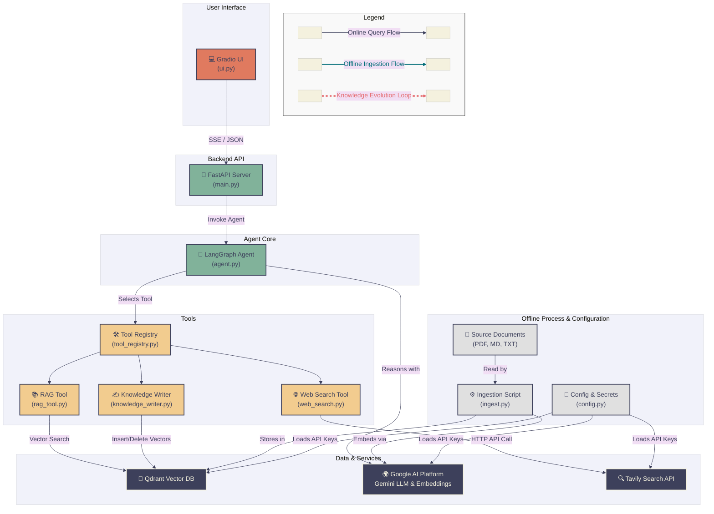

<div align="center">
  
  # **Cognitagent**

  **一個基於 LangGraph 打造、具備自我進化能力的 Agentic AI 框架。它不僅是 RAG 的再進化，更是實現了知識的「自主寫回與精煉」閉環，目標是打造一個能與企業共同成長、甚至預測未來知識需求的「永續智慧體」。**
 
  <p>
    <!-- <a href="[CI Workflow 連結]">
      
    </a> -->
    <!-- <a href="[Codecov 連結]">
      
    </a> -->
    <a href="[你的部署狀態連結，例如 Vercel]">
      
    </a>
    <a href="LICENSE">
      
    </a>
  </p>
</div>

<!-- <p align="center">
  <a href="[你的線上 Demo 連結]"><strong>🚀 互動式線上 Demo</strong></a>
  &nbsp;&nbsp;&nbsp;|&nbsp;&nbsp;&nbsp;
  <a href="[你的 Loom 導覽影片連結]"><strong>🎬 觀看 2 分鐘導覽影片</strong></a>
  &nbsp;&nbsp;&nbsp;|&nbsp;&nbsp;&nbsp;
  <a href="[你的技術部落格文章連結]"><strong>✍️ 深入閱讀設計思路</strong></a>
</p> -->

<!-- <div align="center">
  
</div> -->
<!-- 
內容： 這個 GIF 應該要能在 15 秒內完整展示核心價值。例如：

提問 A：「什麼是 LangGraph？」 -> Agent 從知識庫回答。

提供新知：「LangGraph 是由 LangChain 團隊開發的...它特別適合需要 agentic reasoning loop 的場景。」 -> Agent 執行 SaveNewKnowledgeTool，顯示知識已更新。

再次提問 A：「什麼是 LangGraph？」 -> Agent 給出了一個更豐富、更準確的新答案。
-->

---

## 🎯 問題背景 (The Problem)

在當今以數據驅動決策的商業環境中，企業的**集體智慧（Collective Intelligence**正迅速成為其核心競爭力。然而，現有的知識管理系統，包括主流的 RAG AI 應用，都面臨一個根本性的瓶頸：**知識熵增定律**。

資訊被提取後便迅速過時，形成一個只能「讀取」的靜態時間切片。這不僅導致 AI 回應的準確性與信任度持續衰減，更嚴重的是，它讓整個知識庫從一個潛在的「智慧資產」退化為一個需要高昂人力成本來對抗其腐化的「數據負債」。

我深刻體會到這種持續的資訊衰退不僅是技術問題，更是對企業創新速度與決策品質的隱性拖累。因此，我決心打造一個能打破此熵增循環、實現知識自主進化的 Agentic AI 框架。

這個專案不僅僅是一個概念驗證，而是一個以企業級標準打造的解決方案。從一開始，我就將模組化架構、全面的單元與整合測試 (tests/)，以及容器化的 DevOps 流程 (Dockerfile) 視為核心，旨在將一個前瞻性的 AI 願景，建立在穩固且可維護的工程基礎之上。

## ✨ 核心價值與功能 (Core Value & Features)

本專案的核心價值是提供**自主進化、企業級就緒的 Agentic AI 框架，將靜態的知識庫轉變為動態的智慧資產**。主要功能包括：

* **知識進化閉環 (Knowledge Evolution Loop)**：透過獨創的「原子化-比對-融合」流程，Agent 能自主地將對話或外部搜尋中獲得的新知寫回核心知識庫。此自動化機制取代了數小時甚至數日的人工更新，從根本上解決了傳統 RAG 系統的資訊過時與知識熵增問題。
* **可擴展的 Agentic 核心架構**：基於 LangGraph 的狀態機設計，Agent 能進行多步推理與工具的迴圈調用，而非線性地執行任務。開發者只需專注於工具的實現，即可無縫擴充 Agent 的能力（如網路搜尋、知識庫查詢等），預計可將新功能的整合效率提升 90% 以上。
* **生產環境就緒 (Production-Ready) 的工程實踐**：專案採用 API 優先的解耦設計 (FastAPI + Gradio)，並整合了全面的單元與整合測試 (pytest) 及容器化部署 (Dockerfile)，確保了系統在生產環境下的高可靠性、可維護性與可擴展性。

## 🛠️ 技術架構與深度剖析 (Architecture & In-depth Analysis)

### 1. 系統架構圖



### 2. 架構演進與關鍵權衡 (Architectural Evolution & Trade-offs)
#### **主題一：從「線性工作流」到「自主 Agent 狀態機」的演進**
* **背景：** 專案的核心目標是打造一個能「自我進化」的知識庫 AI。這不僅需要讀取資料 (RAG)，更需要 AI 能在對話中學習，並自主決定何時將新知「寫回」知識庫。
* **權衡考量：**
    * **方案 A (LlamaIndex + 傳統 LangChain Chains)：** 此方案將所有操作串接成一個固定的、線性的工作流 (Retrieve -> Synthesize -> Decide -> Write)。優點是結構簡單，開發初期容易理解與實現。缺點是極度僵化，AI 無法根據情境動態調整行為。例如，它無法在「查詢知識庫」和「上網搜尋」之間做出選擇，也無法在工具執行失敗後進行重試或選擇替代方案。
    * **方案 B (LlamaIndex + LangChain + LangGraph)：** 此方案引入 LangGraph 將 Agent 建構成一個狀態機 (State Machine)。優點是賦予了 Agent 真正的自主判斷能力。它可以在圖 (Graph) 的節點之間迴圈、設立條件分支，並根據當前對話狀態，從多個工具中動態選擇最合適的一個執行。這完美地滿足了專案對「自主進化」的需求。缺點是初期學習曲線較陡峭，且對話流程的管理變得更為複雜。

* **最終決策：** 堅定地選擇 **LangGraph**。因為專案的靈魂在於 AI 的「自主性」與「動態決策」。一個固定的線性鏈無法承載一個能夠思考、規劃、並從錯誤中調整的智慧體。LangGraph 提供的迴圈與條件判斷能力，是實現「知識進化閉環」不可或缺的基石。方案。

* **反思與學習：** 這次架構升級讓我深刻體會到，打造高級 AI 系統的關鍵，已從「編排固定的工作流」轉變為 **「設計一個具備決策能力的智慧代理」**。

#### **主題二：打造知識庫的「自愈」與「進化」機制**

* **克服的最大挑戰:**
    * 在開發核心的 **「知識寫入與融合」模組**：如何設計一個可靠的AI決策流程，來判斷新知識應該被「新增」、「更新」還是「忽略」。起初我嘗試使用簡單的向量相似度比對，若相似度高於閾值就直接覆蓋。但這導致了大量有價值的細節在更新中遺失，或是產生了許多高度重複但略有差異的資訊片段。

    * 實現 **「原子化-比對-融合」**演算法：
      * 原子化 (Atomize): 先將新知識塊透過 LLM 分解成最小的、獨立的「原子事實」單元。
      * 比對 (Retrieve): 對每一個原子事實，在向量資料庫中檢索最相似的現有知識節點。
      * 融合 (Merge): 如果找到高度相似的節點，我會啟用一個專門的「融合 Prompt」，讓 LLM 扮演知識編輯的角色，將新舊兩個版本的資訊智能地合併成一個更完整、更準確的「合併版本」。
      * 決策 (Decide): 只有當「合併版本」與「舊版本」在語意上有顯著差異時，系統才會執行「刪除舊節點並插入新節點」的更新操作，否則將跳過以避免冗餘。

* **這次經歷讓我學到：** 建立一個可靠的自主 AI 系統，關鍵不在於單一的、強大的 Prompt，而在於為 AI 設計一套穩健的、具備多重檢查與平衡的決策框架。將複雜任務分解，並為每個子任務設計專門的 AI 角色，是確保最終輸出品質與可靠性的不二法門。

* **目前的已知限制:**
    * LLM 決策的不可靠性：核心的「知識融合」過程高度依賴 LLM 的判斷力。雖然目前的 Prompt 工程已相當穩健，但在面對模稜兩可或高度專業的知識時，LLM 仍可能做出次優的合併決策。系統目前缺少一個「人類在環」(Human-in-the-loop) 的審核機制來校準這些關鍵決策。
    * 測試的侷限性：儘管專案擁有涵蓋率頗高的單元與整合測試，但這些測試大量依賴對 LLM API 的 Mock。這意味著測試能驗證程式碼的邏輯路徑是否正確，卻無法真正評估 AI 在真實場景下生成內容的「品質」。建立一套可靠的 AI 輸出 E2E 評估框架，是專案後續的重要課題。

## 🚀 快速啟動與測試 (Quick Start & Testing)
<!--
### 環境需求
* Docker & Docker Compose v2.0+
* Go 1.21+
* Node.js 20+

### 一鍵啟動
```bash
# 複製專案並進入目錄
git clone [https://github.com/](https://github.com/)[使用者名稱]/[倉庫名稱].git
cd [倉庫名稱]

# 啟動所有服務
docker-compose up --build
-->