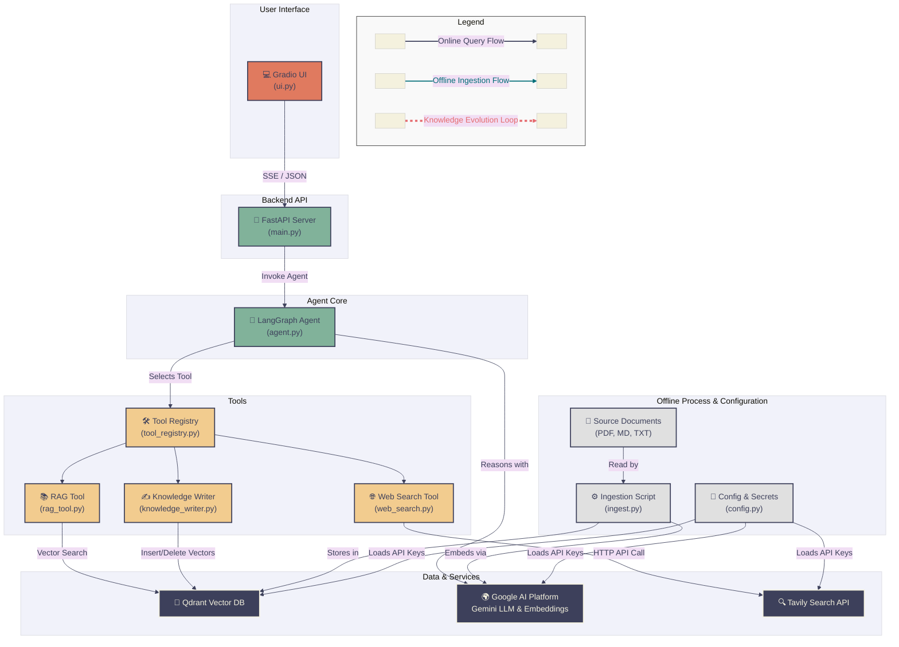
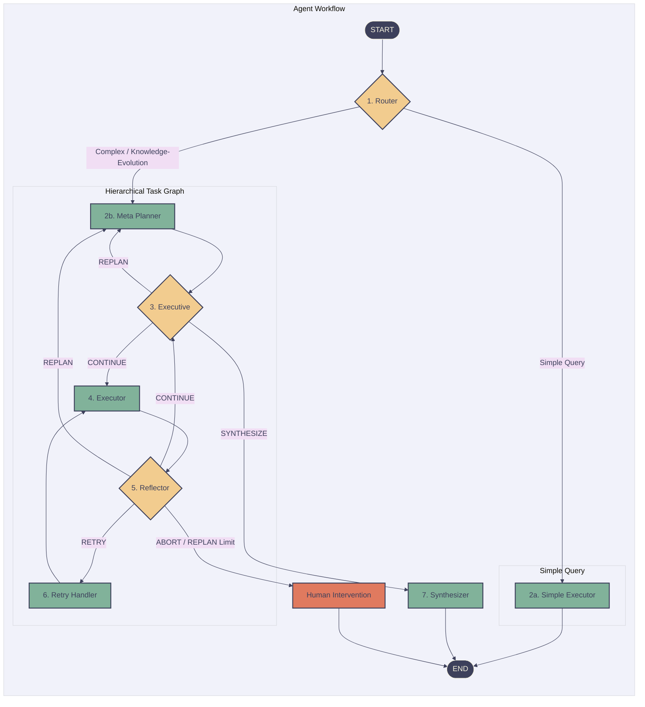

<div align="center">
  
  # **Cognitagent**

**A self-evolving Agentic AI framework built on LangGraph.**  
Beyond retrieval-augmented generation — a closed-loop system where knowledge writes itself back.
 
  <p>
    <!-- <a href="[CI Workflow 連結]">
      
    </a> -->
    <!-- <a href="[Codecov 連結]">
      
    <a href="[你的部署狀態連結，例如 Vercel]">
      
    </a>
    <a href="LICENSE">
      
    </a>
    </a> -->
    <a href="https://www.python.org/">
      
    </a>
    <a href="https://langchain-ai.github.io/langgraph/">
      
    </a>
    <a href="https://fastapi.tiangolo.com/">
      
    </a>
    <a href="https://www.gradio.app/">
      
    </a>
    <a href="https://qdrant.tech/">
      
    </a>
    <a href="https://ai.google.dev/">
      
    </a>
    <a href="tests/">
      
    </a>
    <a href="Dockerfile">
      
    </a>
  </p>
</div>

---

## Motivation

Enterprise AI systems share a structural flaw: they accumulate knowledge at ingestion time and then freeze it.

Every conventional RAG deployment creates a **static snapshot** of the organization's knowledge. The moment that snapshot is taken, it begins to decay. Information retrieved from last quarter's reports answers questions about last quarter — not today. Keeping the knowledge base current demands continuous, expensive human curation: re-embedding documents, managing deletions, reconciling contradictions. Most teams simply don't keep up, and the knowledge base drifts further from reality over time, eroding both the accuracy of AI responses and user trust.

This is the **Knowledge Entropy Problem**: the tendency of static knowledge stores to degrade in relevance as the world moves on around them.

```
Traditional RAG Lifecycle

  Documents ──→ Embed ──→ Store ──→ Retrieve ──→ Generate
                  ▲
          [knowledge frozen here]
          Accuracy decays with every passing day.
          Maintenance cost compounds continuously.
```

Cognitagent breaks the freeze. Rather than treating the knowledge base as a read-only index, Cognitagent treats it as a **living asset** — one that the agent actively reads from and writes back to. Every conversation, every web-search result, and every newly discovered fact becomes an opportunity to refine what the system knows. The curation burden shifts from human annotators to the agent itself.


---

## Core Innovation: The Atomize–Retrieve–Merge Algorithm

The `knowledge_writer` tool implements Cognitagent's primary research contribution: an LLM-driven four-phase pipeline that decides — with high fidelity — whether new information should update the knowledge base and precisely *how* that update should be structured.

### Phase 1 — Atomize

Raw input (dialogue context, web-search snippet, uploaded document) is decomposed by an LLM into the smallest semantically self-contained units: **atomic facts**. Each atomic fact carries a single, verifiable claim with no implicit dependencies.

```
Input: "As of Q1 2025, Cognitagent v2 added support for OpenAI-compatible
        endpoints and reduced mean latency to 420 ms on the standard benchmark."

Atomic Facts:
  [A]  Cognitagent v2 was released in Q1 2025.
  [B]  Cognitagent v2 supports OpenAI-compatible endpoints.
  [C]  Cognitagent v2 achieves 420 ms mean latency on the standard benchmark.
```

Atomization prevents the aliasing problem: a dense paragraph cannot be meaningfully compared against isolated vector nodes. Atomic facts can.

### Phase 2 — Retrieve

For each atomic fact, a semantic vector search against Qdrant returns the nearest existing knowledge node. The retrieval threshold is configurable via `KNOWLEDGE_MERGE_THRESHOLD`.

- **Above threshold** → candidate for merge (proceed to Phase 3).
- **Below threshold** → no conflict; the fact is a genuine addition (skip to Phase 4, INSERT path).

### Phase 3 — Merge

A dedicated merge prompt presents both the incoming atomic fact and the retrieved node to the LLM, instructing it to act as a **knowledge editor**: produce a single, maximally informative unified statement that supersedes both inputs. The merge prompt explicitly surfaces temporal markers, quantitative values, and qualifiers to prevent silent data loss.

```
Incoming:  "Cognitagent v2 achieves 420 ms mean latency (Q1 2025 benchmark)."
Existing:  "Cognitagent v1 achieves 610 ms mean latency (Q3 2024 benchmark)."

Merged:    "Cognitagent reduced mean latency from 610 ms (v1, Q3 2024)
            to 420 ms (v2, Q1 2025) on the standard benchmark."
```

### Phase 4 — Decide

The merged output is embedded and compared against the original retrieved node. If the semantic distance exceeds a significance threshold, the system executes an **atomic swap**: delete the stale node, insert the merged node. If the distance is negligible — meaning the merge produced no informational gain — the operation is skipped entirely. This guards against write amplification and vector store bloat.

```
          New atomic fact
               │
               ▼
      [Phase 1: Atomize]
               │
   ┌─── for each atom ───┐
   │  [Phase 2: Retrieve]│
   └──────┬──────┬───────┘
          │      │
  sim > τ │      │ sim ≤ τ
          │      └──────────────────────────────→ INSERT (new node)
          ▼
  [Phase 3: Merge]
          │
  [Phase 4: Decide]
          │
  Δsem > ε│      Δsem ≤ ε
          │      └──────────────────────────────→ SKIP (no-op)
          ▼
  DELETE old node + INSERT merged node
```

The result: a knowledge base that **self-heals** — never frozen, never unbounded, never internally inconsistent.

---

## System Architecture

### 1. Service Topology

```mermaid
%%{init: {'theme': 'base', 'themeVariables': { 'primaryColor': '#F4F1DE', 'primaryTextColor': '#3D405B', 'lineColor': '#3D405B', 'textColor': '#3D405B', 'actorBorder': '#3D405B', 'actorBkg': '#F4F1DE'}}}%%
graph TD
    subgraph Legend
        direction LR
        L1[ ] -- Online Query Flow --> L2[ ]
        L3[ ] -- Offline Ingestion Flow --> L4[ ]
        L5[ ] -- Knowledge Evolution Loop --> L6[ ]
    end

    subgraph "User Interface"
        UI["💻 Gradio UI<br>(ui.py)"]
    end

    subgraph "Backend API"
        API["🚀 FastAPI Server<br>(main.py)"]
    end

    subgraph "Agent Core"
        Agent["🧠 LangGraph Agent<br>(agent.py)"]
    end

    subgraph "Tools"
        ToolRegistry["🛠️ Tool Registry<br>(tool_registry.py)"]
        WebSearch["🌐 Web Search Tool<br>(web_search.py)"]
        RAG["📚 RAG Tool<br>(rag_tool.py)"]
        Writer["✍️ Knowledge Writer<br>(knowledge_writer.py)"]
    end

    subgraph "Data & Services"
        Qdrant["💾 Qdrant Vector DB"]
        GoogleAI["🌍 Google AI Platform<br>Gemini LLM & Embeddings"]
        Tavily["🔍 Tavily Search API"]
    end
    
    subgraph "Offline Process & Configuration"
        Ingest["⚙️ Ingestion Script<br>(ingest.py)"]
        Docs["📄 Source Documents<br>(PDF, MD, TXT)"]
        Config["📜 Config & Secrets<br>(config.py)"]
    end

    %% Connections with enhanced labels
    UI -- "SSE / JSON" --> API
    API -- "Invoke Agent" --> Agent
    Agent -- "Selects Tool" --> ToolRegistry
    ToolRegistry --> WebSearch
    ToolRegistry --> RAG
    ToolRegistry --> Writer
    Agent -- "Reasons with" --> GoogleAI

    RAG -- "Vector Search" --> Qdrant
    Writer -- "Insert/Delete Vectors" --> Qdrant
    WebSearch -- "HTTP API Call" --> Tavily

    %% Offline Path
    Docs -- "Read by" --> Ingest
    Ingest -- "Embeds via" --> GoogleAI
    Ingest -- "Stores in" --> Qdrant

    %% Configuration Path
    Config -- "Loads API Keys" --> GoogleAI
    Config -- "Loads API Keys" --> Qdrant
    Config -- "Loads API Keys" --> Tavily

    %% Define Link Styles
    linkStyle 0 stroke:#3D405B,stroke-width:2px,color:#3D405B
    linkStyle 1 stroke:#006d77,stroke-width:2px,color:#006d77
    linkStyle 2 stroke:#e56b6f,stroke-width:4px,stroke-dasharray: 5 5,color:#e56b6f

    %% Styling using classDef (more robust)
    classDef legendStyle fill:#f9f9f9,stroke:#333,stroke-width:1px
    classDef uiStyle fill:#E07A5F,stroke:#3D405B,stroke-width:2px
    classDef apiStyle fill:#81B29A,stroke:#3D405B,stroke-width:2px
    classDef toolStyle fill:#F2CC8F,stroke:#3D405B,stroke-width:2px
    classDef dataStyle fill:#3D405B,stroke:#F4F1DE,stroke-width:2px,color:#F4F1DE
    classDef offlineStyle fill:#e0e0e0,stroke:#3D405B,stroke-width:2px

    %% Apply Styles to Node IDs
    class Legend legendStyle
    class UI uiStyle
    class API,Agent apiStyle
    class ToolRegistry,WebSearch,RAG,Writer toolStyle
    class Qdrant,GoogleAI,Tavily dataStyle
    class Ingest,Docs,Config offlineStyle
```

### 2. Agent State Machine
Cognitagent routes requests through a six-node LangGraph state machine. Simple factual queries short-circuit to a single-call executor. Complex tasks — including all knowledge-evolution operations — are dispatched into the full DEHP planning loop (Decompose → Execute → Heal → Produce).


```mermaid
%%{init: {'theme': 'base', 'themeVariables': { 'primaryColor': '#F4F1DE', 'primaryTextColor': '#3D405B', 'lineColor': '#3D405B', 'textColor': '#3D405B', 'actorBorder': '#3D405B', 'actorBkg': '#F4F1DE'}}}%%
graph TD
    subgraph "Agent Workflow"
        direction TB
        A_START([START]) --> B_ROUTER{1. Router<br>};

        subgraph "Simple Query"
            direction TB
            C_SIMPLE[2a. Simple Executor<br>];
        end

        subgraph "Hierarchical Task Graph"
            direction TB
            D_PLANNER[2b. Meta Planner<br>];
            E_EXECUTIVE{3. Executive<br>};
            F_EXECUTOR[4. Executor<br>];
            G_REFLECTOR{5. Reflector<br>};
            H_RETRY[6. Retry Handler<br>];
        end
        
        I_SYNTHESIZER[7. Synthesizer<br>];
        J_HUMAN_INTERVENTION[Human Intervention<br>];
        K_END([END]);

        %% 流程連接
        B_ROUTER -- "Simple Query" --> C_SIMPLE;
        B_ROUTER -- "Complex / Knowledge-Evolution " --> D_PLANNER;

        C_SIMPLE --> K_END;

        D_PLANNER --> E_EXECUTIVE;
        
        E_EXECUTIVE -- "CONTINUE<br>" --> F_EXECUTOR;
        E_EXECUTIVE -- "REPLAN<br>" --> D_PLANNER;
        E_EXECUTIVE -- "SYNTHESIZE<br>" --> I_SYNTHESIZER;
        
        F_EXECUTOR --> G_REFLECTOR;

        G_REFLECTOR -- "CONTINUE<br>" --> E_EXECUTIVE;
        G_REFLECTOR -- "REPLAN<br>" --> D_PLANNER;
        G_REFLECTOR -- "RETRY<br>" --> H_RETRY;
        G_REFLECTOR -- "ABORT / REPLAN Limit<br>" --> J_HUMAN_INTERVENTION;

        H_RETRY --> F_EXECUTOR;
        
        I_SYNTHESIZER --> K_END;
        J_HUMAN_INTERVENTION --> K_END;

    end

    %% 節點樣式
    classDef startEnd fill:#3D405B,stroke:#F4F1DE,color:#F4F1DE;
    classDef decision fill:#F2CC8F,stroke:#3D405B,stroke-width:2px;
    classDef process fill:#81B29A,stroke:#3D405B,stroke-width:2px;
    classDef error fill:#E07A5F,stroke:#3D405B,stroke-width:2px;

    class A_START,K_END startEnd;
    class B_ROUTER,E_EXECUTIVE,G_REFLECTOR decision;
    class C_SIMPLE,D_PLANNER,F_EXECUTOR,H_RETRY,I_SYNTHESIZER process;
    class J_HUMAN_INTERVENTION error;
```
Each node is a typed LangGraph node backed by a Pydantic-validated `AgentState` schema. State transitions are explicit and logged, giving full observability into every decision the agent makes without requiring an external tracing tool during development.

---

## Repository Layout

```
Cognitagent/
│
├── main.py                       # FastAPI application entry point
├── requirements.txt              # Pinned Python dependencies
├── pytest.ini                    # pytest configuration
├── Dockerfile                    # Backend container image
├── frontend.Dockerfile           # Gradio frontend container image
├── temp.env                      # Environment variable template → copy to .env
├── create_test_structure.py      # Test fixture scaffolding helper
│
├── app/
│   └── ui.py                     # Gradio interface; SSE streaming to FastAPI
│
├── core/                         # All business logic — no framework leakage
│   ├── agent.py                  # LangGraph state machine definition
│   ├── tool_registry.py          # Dynamic tool registration and dispatch
│   ├── config.py                 # Pydantic settings; loaded from .env
│   └── tools/
│       ├── rag_tool.py           # Semantic vector search over Qdrant
│       ├── web_search.py         # Tavily Search API wrapper
│       └── knowledge_writer.py   # Atomize–Retrieve–Merge pipeline (core R&D)
│
├── prompts/                      # Versioned prompt templates (Jinja2 / plaintext)
│   └── *.jinja2 / *.txt          # One file per agent node / tool role
│
├── script/
│   └── ingest.py                 # Offline document ingestion and embedding
│
├── source_docs/                  # Place PDF / MD / TXT files here for ingestion
│
└── tests/
    ├── unit/                     # Isolated module tests; all LLM calls mocked
    └── integration/              # End-to-end API and state-machine tests
```
All production logic lives under `core/`. The directory enforces a strict dependency boundary: `main.py` and `app/` call into `core/`, but `core/` imports nothing from either. The agent logic is independently testable, importable, and reusable across deployment surfaces.

---

## Getting Started

### Prerequisites

| Dependency | Minimum Version | Purpose |
|---|---|---|
| Python | 3.10 | Runtime |
| Docker & Docker Compose | 24.0 | Containerized deployment *(optional)* |
| Qdrant | Cloud or self-hosted | Vector database |
| Google AI API key | — | Gemini LLM and text embeddings |
| Tavily API key | — | Web search tool |

---

### Local Setup

**1. Clone the repository**

```bash
git clone https://github.com/WRSHIH/Cognitagent.git
cd Cognitagent
```

**2. Create a virtual environment and install dependencies**

```bash
python -m venv .venv
source .venv/bin/activate          # Windows: .venv\Scripts\activate
pip install -r requirements.txt
```

**3. Configure environment variables**

```bash
cp temp.env .env
# Open .env in your editor and fill in the required keys
```

**4. Ingest your documents**

Place PDF, Markdown, or plain-text files into `source_docs/`, then run:

```bash
python script/ingest.py
```

**5. Start the services**

```bash
# Terminal 1 — FastAPI backend (default: http://localhost:8000)
python main.py

# Terminal 2 — Gradio frontend (default: http://localhost:7860)
python app/ui.py
```

Open `http://localhost:7860` in your browser to begin.

---

### Docker Deployment

```bash
# Build images
docker build -t cognitagent-backend  -f Dockerfile          .
docker build -t cognitagent-frontend -f frontend.Dockerfile  .

# Run (requires a populated .env file)
docker run -d --env-file .env -p 8000:8000 cognitagent-backend
docker run -d --env-file .env -p 7860:7860 cognitagent-frontend
```

For production deployments, compose all three services — backend, frontend, and Qdrant — in a single `docker-compose.yml` with a shared bridge network. Services communicate by container name rather than `localhost`, which requires no additional networking configuration.

---

## Configuration Reference

Copy `temp.env` to `.env` and populate every field. The file is listed in `.gitignore`; never commit credentials to version control.

```dotenv
# ── Google AI ──────────────────────────────────────────────────────────────
GOOGLE_API_KEY=your_google_ai_api_key
GEMINI_MODEL=gemini-2.5-flash or gemini-2.5-pro

# ── Qdrant ─────────────────────────────────────────────────────────────────
QDRANT_URL=https://your-cluster.qdrant.io
QDRANT_API_KEY=your_qdrant_api_key
QDRANT_COLLECTION_NAME=cognitagent_kb      # created automatically on first ingest

# ── Tavily Web Search ───────────────────────────────────────────────────────
TAVILY_API_KEY=your_tavily_api_key

# ── Agent Behavior ──────────────────────────────────────────────────────────
MAX_RETRY_ATTEMPTS=3                       # maximum retries per Executor invocation
KNOWLEDGE_MERGE_THRESHOLD=0.85            # cosine similarity gate for merge vs. insert (0–1)
```

`KNOWLEDGE_MERGE_THRESHOLD` is the most consequential tuning knob. Higher values (e.g., `0.92`) make the merge gate stricter — more facts are inserted as new nodes rather than merged. Lower values (e.g., `0.75`) cause more aggressive merging, which risks collapsing genuinely distinct facts. The default of `0.85` performs well across general enterprise knowledge bases.

---

## Ingesting Documents into the Knowledge Base

`script/ingest.py` reads source files from `source_docs/`, chunks them, embeds each chunk via the Google AI Embeddings API, and upserts the resulting vectors into Qdrant. The script is idempotent: it checksums each source file and skips re-ingestion of unchanged content.

**Supported formats:**

| Format | Extension | Chunking Strategy |
|---|---|---|
| PDF | `.pdf` | Paragraph-aware; preserves page boundaries |
| Markdown | `.md` | Splits on heading boundaries |
| Plain text | `.txt` | Fixed-size windows with configurable overlap |

**Example run:**

```bash
$ python script/ingest.py

[INFO]  Processing: technical_spec_v3.pdf   (18 pages)
[INFO]  Generated 94 chunks → embedded → stored ✓
[INFO]  Processing: onboarding_guide.md
[INFO]  Generated 31 chunks → embedded → stored ✓
[INFO]  Skipping:   annual_report_2023.pdf   (unchanged, checksum match)
[INFO]  Ingestion complete. Active vectors: 2,847
```

> **Cost note.** Embedding large document sets consumes Google AI API quota proportional to token count. Run `ingest.py` during off-peak hours and monitor usage in the Google Cloud console before processing very large corpora.

---

## License

Distributed under the [MIT License](LICENSE). You are free to use, copy, modify, and distribute this software provided the original copyright notice is retained.

---

<div align="center">

*Built by [WRSHIH](https://github.com/WRSHIH)*

If this project is useful to you, a ⭐ helps others find it.

</div>
