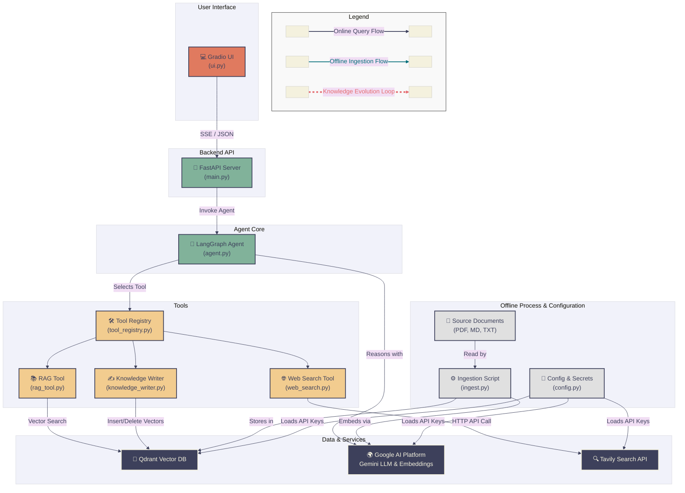
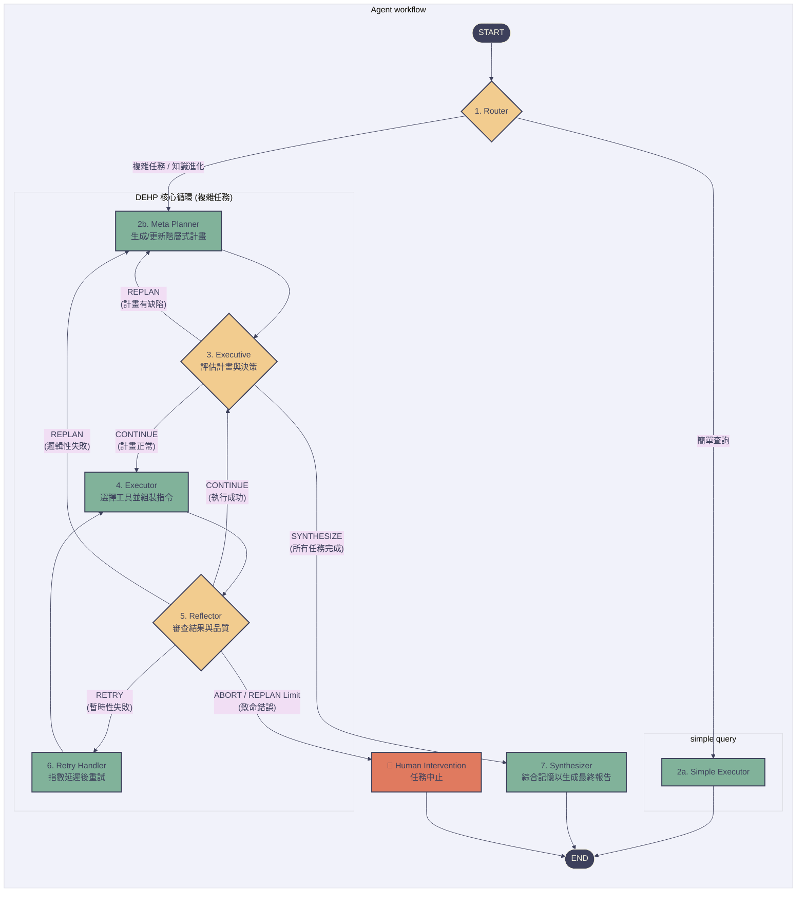

<div align="center">
  
  # **Cognitagent**

**A self-evolving Agentic AI framework built on LangGraph.**  
Beyond retrieval-augmented generation — a closed-loop system where knowledge writes itself back.
 
  <p>
    <!-- <a href="[CI Workflow 連結]">
      
    </a> -->
    <!-- <a href="[Codecov 連結]">
      
    <a href="[你的部署狀態連結，例如 Vercel]">
      
    </a>
    <a href="LICENSE">
      
    </a>
    </a> -->
    <a href="https://www.python.org/">
      
    </a>
    <a href="https://langchain-ai.github.io/langgraph/">
      
    </a>
    <a href="https://fastapi.tiangolo.com/">
      
    </a>
    <a href="https://www.gradio.app/">
      
    </a>
    <a href="https://qdrant.tech/">
      
    </a>
    <a href="https://ai.google.dev/">
      
    </a>
    <a href="tests/">
      
    </a>
    <a href="Dockerfile">
      
    </a>
  </p>
</div>

---

## Motivation

Enterprise AI systems share a structural flaw: they accumulate knowledge at ingestion time and then freeze it.

Every conventional RAG deployment creates a **static snapshot** of the organization's knowledge. The moment that snapshot is taken, it begins to decay. Information retrieved from last quarter's reports answers questions about last quarter — not today. Keeping the knowledge base current demands continuous, expensive human curation: re-embedding documents, managing deletions, reconciling contradictions. Most teams simply don't keep up, and the knowledge base drifts further from reality over time, eroding both the accuracy of AI responses and user trust.

This is the **Knowledge Entropy Problem**: the tendency of static knowledge stores to degrade in relevance as the world moves on around them.

```
Traditional RAG Lifecycle

  Documents ──→ Embed ──→ Store ──→ Retrieve ──→ Generate
                  ▲
          [knowledge frozen here]
          Accuracy decays with every passing day.
          Maintenance cost compounds continuously.
```

Cognitagent breaks the freeze. Rather than treating the knowledge base as a read-only index, Cognitagent treats it as a **living asset** — one that the agent actively reads from and writes back to. Every conversation, every web-search result, and every newly discovered fact becomes an opportunity to refine what the system knows. The curation burden shifts from human annotators to the agent itself.


---

## Core Innovation: The Atomize–Retrieve–Merge Algorithm

The `knowledge_writer` tool implements Cognitagent's primary research contribution: an LLM-driven four-phase pipeline that decides — with high fidelity — whether new information should update the knowledge base and precisely *how* that update should be structured.

### Phase 1 — Atomize

Raw input (dialogue context, web-search snippet, uploaded document) is decomposed by an LLM into the smallest semantically self-contained units: **atomic facts**. Each atomic fact carries a single, verifiable claim with no implicit dependencies.

```
Input: "As of Q1 2025, Cognitagent v2 added support for OpenAI-compatible
        endpoints and reduced mean latency to 420 ms on the standard benchmark."

Atomic Facts:
  [A]  Cognitagent v2 was released in Q1 2025.
  [B]  Cognitagent v2 supports OpenAI-compatible endpoints.
  [C]  Cognitagent v2 achieves 420 ms mean latency on the standard benchmark.
```

Atomization prevents the aliasing problem: a dense paragraph cannot be meaningfully compared against isolated vector nodes. Atomic facts can.

### Phase 2 — Retrieve

For each atomic fact, a semantic vector search against Qdrant returns the nearest existing knowledge node. The retrieval threshold is configurable via `KNOWLEDGE_MERGE_THRESHOLD`.

- **Above threshold** → candidate for merge (proceed to Phase 3).
- **Below threshold** → no conflict; the fact is a genuine addition (skip to Phase 4, INSERT path).

### Phase 3 — Merge

A dedicated merge prompt presents both the incoming atomic fact and the retrieved node to the LLM, instructing it to act as a **knowledge editor**: produce a single, maximally informative unified statement that supersedes both inputs. The merge prompt explicitly surfaces temporal markers, quantitative values, and qualifiers to prevent silent data loss.

```
Incoming:  "Cognitagent v2 achieves 420 ms mean latency (Q1 2025 benchmark)."
Existing:  "Cognitagent v1 achieves 610 ms mean latency (Q3 2024 benchmark)."

Merged:    "Cognitagent reduced mean latency from 610 ms (v1, Q3 2024)
            to 420 ms (v2, Q1 2025) on the standard benchmark."
```

### Phase 4 — Decide

The merged output is embedded and compared against the original retrieved node. If the semantic distance exceeds a significance threshold, the system executes an **atomic swap**: delete the stale node, insert the merged node. If the distance is negligible — meaning the merge produced no informational gain — the operation is skipped entirely. This guards against write amplification and vector store bloat.

```
          New atomic fact
               │
               ▼
      [Phase 1: Atomize]
               │
   ┌─── for each atom ───┐
   │  [Phase 2: Retrieve]│
   └──────┬──────┬───────┘
          │      │
  sim > τ │      │ sim ≤ τ
          │      └──────────────────────────────→ INSERT (new node)
          ▼
  [Phase 3: Merge]
          │
  [Phase 4: Decide]
          │
  Δsem > ε│      Δsem ≤ ε
          │      └──────────────────────────────→ SKIP (no-op)
          ▼
  DELETE old node + INSERT merged node
```

The result: a knowledge base that **self-heals** — never frozen, never unbounded, never internally inconsistent.

---

## System Architecture

### 1. Service Topology

```mermaid
%%{init: {'theme': 'base', 'themeVariables': { 'primaryColor': '#F4F1DE', 'primaryTextColor': '#3D405B', 'lineColor': '#3D405B', 'textColor': '#3D405B', 'actorBorder': '#3D405B', 'actorBkg': '#F4F1DE'}}}%%
graph TD
    subgraph Legend
        direction LR
        L1[ ] -- Online Query Flow --> L2[ ]
        L3[ ] -- Offline Ingestion Flow --> L4[ ]
        L5[ ] -- Knowledge Evolution Loop --> L6[ ]
    end

    subgraph "User Interface"
        UI["💻 Gradio UI<br>(ui.py)"]
    end

    subgraph "Backend API"
        API["🚀 FastAPI Server<br>(main.py)"]
    end

    subgraph "Agent Core"
        Agent["🧠 LangGraph Agent<br>(agent.py)"]
    end

    subgraph "Tools"
        ToolRegistry["🛠️ Tool Registry<br>(tool_registry.py)"]
        WebSearch["🌐 Web Search Tool<br>(web_search.py)"]
        RAG["📚 RAG Tool<br>(rag_tool.py)"]
        Writer["✍️ Knowledge Writer<br>(knowledge_writer.py)"]
    end

    subgraph "Data & Services"
        Qdrant["💾 Qdrant Vector DB"]
        GoogleAI["🌍 Google AI Platform<br>Gemini LLM & Embeddings"]
        Tavily["🔍 Tavily Search API"]
    end
    
    subgraph "Offline Process & Configuration"
        Ingest["⚙️ Ingestion Script<br>(ingest.py)"]
        Docs["📄 Source Documents<br>(PDF, MD, TXT)"]
        Config["📜 Config & Secrets<br>(config.py)"]
    end

    %% Connections with enhanced labels
    UI -- "SSE / JSON" --> API
    API -- "Invoke Agent" --> Agent
    Agent -- "Selects Tool" --> ToolRegistry
    ToolRegistry --> WebSearch
    ToolRegistry --> RAG
    ToolRegistry --> Writer
    Agent -- "Reasons with" --> GoogleAI

    RAG -- "Vector Search" --> Qdrant
    Writer -- "Insert/Delete Vectors" --> Qdrant
    WebSearch -- "HTTP API Call" --> Tavily

    %% Offline Path
    Docs -- "Read by" --> Ingest
    Ingest -- "Embeds via" --> GoogleAI
    Ingest -- "Stores in" --> Qdrant

    %% Configuration Path
    Config -- "Loads API Keys" --> GoogleAI
    Config -- "Loads API Keys" --> Qdrant
    Config -- "Loads API Keys" --> Tavily

    %% Define Link Styles
    linkStyle 0 stroke:#3D405B,stroke-width:2px,color:#3D405B
    linkStyle 1 stroke:#006d77,stroke-width:2px,color:#006d77
    linkStyle 2 stroke:#e56b6f,stroke-width:4px,stroke-dasharray: 5 5,color:#e56b6f

    %% Styling using classDef (more robust)
    classDef legendStyle fill:#f9f9f9,stroke:#333,stroke-width:1px
    classDef uiStyle fill:#E07A5F,stroke:#3D405B,stroke-width:2px
    classDef apiStyle fill:#81B29A,stroke:#3D405B,stroke-width:2px
    classDef toolStyle fill:#F2CC8F,stroke:#3D405B,stroke-width:2px
    classDef dataStyle fill:#3D405B,stroke:#F4F1DE,stroke-width:2px,color:#F4F1DE
    classDef offlineStyle fill:#e0e0e0,stroke:#3D405B,stroke-width:2px

    %% Apply Styles to Node IDs
    class Legend legendStyle
    class UI uiStyle
    class API,Agent apiStyle
    class ToolRegistry,WebSearch,RAG,Writer toolStyle
    class Qdrant,GoogleAI,Tavily dataStyle
    class Ingest,Docs,Config offlineStyle
```

### 2. Agent State Machine
Cognitagent routes requests through a six-node LangGraph state machine. Simple factual queries short-circuit to a single-call executor. Complex tasks — including all knowledge-evolution operations — are dispatched into the full DEHP planning loop (Decompose → Execute → Heal → Produce).


```mermaid
%%{init: {'theme': 'base', 'themeVariables': { 'primaryColor': '#F4F1DE', 'primaryTextColor': '#3D405B', 'lineColor': '#3D405B', 'textColor': '#3D405B', 'actorBorder': '#3D405B', 'actorBkg': '#F4F1DE'}}}%%
graph TD
    subgraph "Agent workflow"
        direction TB
        A_START([START]) --> B_ROUTER{1. Router<br>};

        subgraph "simple query"
            direction TB
            C_SIMPLE[2a. Simple Executor<br>];
        end

        subgraph "DEHP 核心循環 (複雜任務)"
            direction TB
            D_PLANNER[2b. Meta Planner<br>生成/更新階層式計畫];
            E_EXECUTIVE{3. Executive<br>評估計畫與決策};
            F_EXECUTOR[4. Executor<br>選擇工具並組裝指令];
            G_REFLECTOR{5. Reflector<br>審查結果與品質};
            H_RETRY[6. Retry Handler<br>指數延遲後重試];
        end
        
        I_SYNTHESIZER[7. Synthesizer<br>綜合記憶以生成最終報告];
        J_HUMAN_INTERVENTION[🚨 Human Intervention<br>任務中止];
        K_END([END]);

        %% 流程連接
        B_ROUTER -- "簡單查詢" --> C_SIMPLE;
        B_ROUTER -- "複雜任務 / 知識進化" --> D_PLANNER;

        C_SIMPLE --> K_END;

        D_PLANNER --> E_EXECUTIVE;
        
        E_EXECUTIVE -- "CONTINUE<br>(計畫正常)" --> F_EXECUTOR;
        E_EXECUTIVE -- "REPLAN<br>(計畫有缺陷)" --> D_PLANNER;
        E_EXECUTIVE -- "SYNTHESIZE<br>(所有任務完成)" --> I_SYNTHESIZER;
        
        F_EXECUTOR --> G_REFLECTOR;

        G_REFLECTOR -- "CONTINUE<br>(執行成功)" --> E_EXECUTIVE;
        G_REFLECTOR -- "REPLAN<br>(邏輯性失敗)" --> D_PLANNER;
        G_REFLECTOR -- "RETRY<br>(暫時性失敗)" --> H_RETRY;
        G_REFLECTOR -- "ABORT / REPLAN Limit<br>(致命錯誤)" --> J_HUMAN_INTERVENTION;

        H_RETRY --> F_EXECUTOR;
        
        I_SYNTHESIZER --> K_END;
        J_HUMAN_INTERVENTION --> K_END;

    end

    %% 節點樣式
    classDef startEnd fill:#3D405B,stroke:#F4F1DE,color:#F4F1DE;
    classDef decision fill:#F2CC8F,stroke:#3D405B,stroke-width:2px;
    classDef process fill:#81B29A,stroke:#3D405B,stroke-width:2px;
    classDef error fill:#E07A5F,stroke:#3D405B,stroke-width:2px;

    class A_START,K_END startEnd;
    class B_ROUTER,E_EXECUTIVE,G_REFLECTOR decision;
    class C_SIMPLE,D_PLANNER,F_EXECUTOR,H_RETRY,I_SYNTHESIZER process;
    class J_HUMAN_INTERVENTION error;
```

### 3. 架構演進與關鍵權衡 (Architectural Evolution & Trade-offs)
#### **主題一：從「線性工作流」到「自主 Agent 狀態機」的演進**
* **背景：** 專案的核心目標是打造一個能「自我進化」的知識庫 AI。這不僅需要讀取資料 (RAG)，更需要 AI 能在對話中學習，並自主決定何時將新知「寫回」知識庫。
* **權衡考量：**
    * **方案 A (LlamaIndex + 傳統 LangChain Chains)：** 此方案將所有操作串接成一個固定的、線性的工作流 (Retrieve -> Synthesize -> Decide -> Write)。優點是結構簡單，開發初期容易理解與實現。缺點是極度僵化，AI 無法根據情境動態調整行為。例如，它無法在「查詢知識庫」和「上網搜尋」之間做出選擇，也無法在工具執行失敗後進行重試或選擇替代方案。
    * **方案 B (LlamaIndex + LangChain + LangGraph)：** 此方案引入 LangGraph 將 Agent 建構成一個狀態機 (State Machine)。優點是賦予了 Agent 真正的自主判斷能力。它可以在圖 (Graph) 的節點之間迴圈、設立條件分支，並根據當前對話狀態，從多個工具中動態選擇最合適的一個執行。這完美地滿足了專案對「自主進化」的需求。缺點是初期學習曲線較陡峭，且對話流程的管理變得更為複雜。

* **最終決策：** 堅定地選擇 **LangGraph**。因為專案的靈魂在於 AI 的「自主性」與「動態決策」。一個固定的線性鏈無法承載一個能夠思考、規劃、並從錯誤中調整的智慧體。LangGraph 提供的迴圈與條件判斷能力，是實現「知識進化閉環」不可或缺的基石。方案。

* **反思與學習：** 這次架構升級讓我深刻體會到，打造高級 AI 系統的關鍵，已從「編排固定的工作流」轉變為 **「設計一個具備決策能力的智慧代理」**。

#### **主題二：打造知識庫的「自愈」與「進化」機制**

* **克服的最大挑戰:**
    * 在開發核心的 **「知識寫入與融合」模組**：如何設計一個可靠的AI決策流程，來判斷新知識應該被「新增」、「更新」還是「忽略」。起初我嘗試使用簡單的向量相似度比對，若相似度高於閾值就直接覆蓋。但這導致了大量有價值的細節在更新中遺失，或是產生了許多高度重複但略有差異的資訊片段。

    * 實現 **「原子化-比對-融合」** 演算法：
      * 原子化 (Atomize): 先將新知識塊透過 LLM 分解成最小的、獨立的「原子事實」單元。
      * 比對 (Retrieve): 對每一個原子事實，在向量資料庫中檢索最相似的現有知識節點。
      * 融合 (Merge): 如果找到高度相似的節點，我會啟用一個專門的「融合 Prompt」，讓 LLM 扮演知識編輯的角色，將新舊兩個版本的資訊智能地合併成一個更完整、更準確的「合併版本」。
      * 決策 (Decide): 只有當「合併版本」與「舊版本」在語意上有顯著差異時，系統才會執行「刪除舊節點並插入新節點」的更新操作，否則將跳過以避免冗餘。

* **這次經歷讓我學到：** 建立一個可靠的自主 AI 系統，關鍵不在於單一的、強大的 Prompt，而在於為 AI 設計一套穩健的、具備多重檢查與平衡的決策框架。將複雜任務分解，並為每個子任務設計專門的 AI 角色，是確保最終輸出品質與可靠性的不二法門。

* **目前的已知限制:**
    * LLM 決策的不可靠性：核心的「知識融合」過程高度依賴 LLM 的判斷力。雖然目前的 Prompt 工程已相當穩健，但在面對模稜兩可或高度專業的知識時，LLM 仍可能做出次優的合併決策。系統目前缺少一個「人類在環」(Human-in-the-loop) 的審核機制來校準這些關鍵決策。
    * 測試的侷限性：儘管專案擁有涵蓋率頗高的單元與整合測試，但這些測試大量依賴對 LLM API 的 Mock。這意味著測試能驗證程式碼的邏輯路徑是否正確，卻無法真正評估 AI 在真實場景下生成內容的「品質」。建立一套可靠的 AI 輸出 E2E 評估框架，是專案後續的重要課題。
<!--
## 🚀 快速啟動與測試 (Quick Start & Testing)

### 環境需求
* Docker & Docker Compose v2.0+
* Go 1.21+
* Node.js 20+

### 一鍵啟動
```bash
# 複製專案並進入目錄
git clone [https://github.com/](https://github.com/)[使用者名稱]/[倉庫名稱].git
cd [倉庫名稱]

# 啟動所有服務
docker-compose up --build
-->
